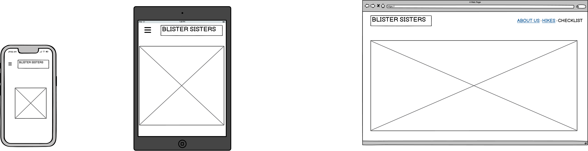
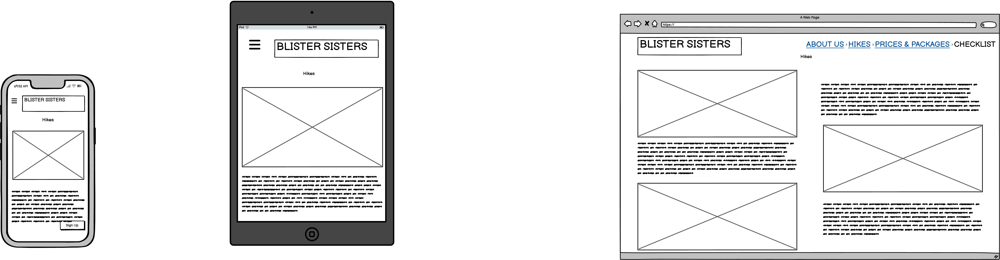
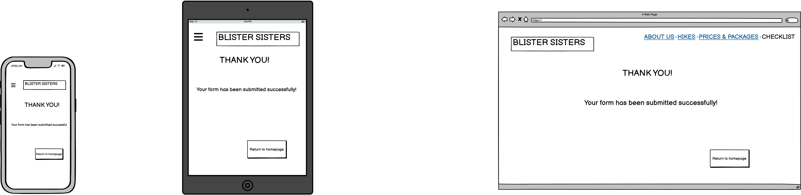

# Blister Sisters

## Fully functioning static HTML/CSS/Bootsrap website.

Blister Sisters is a website created to celebrate a community of women who come together to explore the outdoors, share stories, and support each other through the joys and challenges of hiking. By providing a space for women to connect, learn, and inspire one another, Blister Sisters highlights the significant connection between walking, friendship, and mental well-being.

To view the deployed website click [here](https://your-link-will-go-here.com).

# UXD

## Website Intentions

**For the User:**
- Discover the Blister Sisters community and how they support women hikers.
- Read inspiring stories about women who use hiking to improve their mental well-being.
- Find upcoming meet-ups or ways to join group hikes.
- Share their own hiking experiences or sign up for events.

**For the Site Developer:**
- Provide clear, welcoming content that resonates with women looking for community support.
- Ensure the site is intuitive to navigate, with simple CTAs for joining or sharing stories.
- Create a warm, rustic aesthetic that reflects nature and togetherness.

---

## Creation Process using the Agile Software Development Method

### 1. Requirements
It is a B2C website aimed at women looking to join a supportive hiking community.  
The site should deliver motivating content, clear information on meet-ups, and encourage visitors to get involved by sharing their stories or contacting organizers.

### 2. Scope
The website will feature:
- A minimalist, nature-inspired design using earthy colors and friendly typography.
- Core pages: a landing page, a ‘Meet the Sisters’ section with stories, and a contact form.
- An emphasis on mental health benefits tied to hiking and community.
- Consistent visual language across images, colors, and text to maintain trust and alignment.

### 3. Architecture & Design
**Landing Page:**  
- A hero image that reflects the outdoors and community spirit.
- Immediate CTA to “Join a Hike” or “Read Stories.”

**Meet the Sisters:**  
- A page highlighting personal stories, possibly with short bios or quotes.
- Inspiring images of women hiking together.

**Contact Form:**  
- Easy-to-use form for users to sign up for hikes.

---
### 4. Wireframes
Wireframes were designed using Balsamiq tool. Following best practices, mobile version was designed first, then tablet and lastly the laptop view. 

### Home Page

### About Us Page

### Hikes Page

### Prices and Packages Page

### Checklist Page

### Thank You Page

