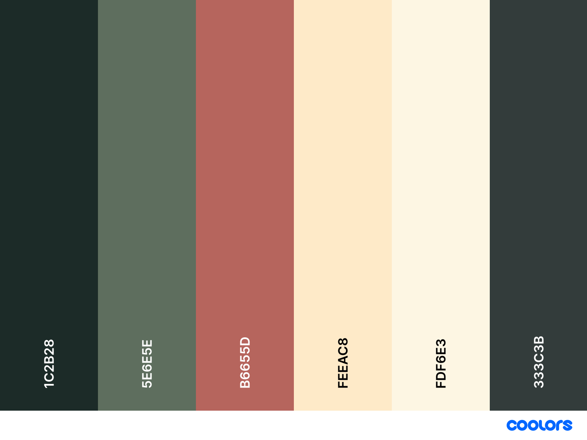
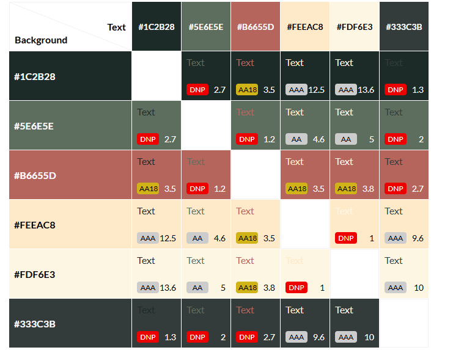

# Blister Sisters

## Fully functioning static HTML/CSS/Bootsrap website.

Blister Sisters is a website created to celebrate a community of women who come together to explore the outdoors, share stories, and support each other through the joys and challenges of hiking. By providing a space for women to connect, learn, and inspire one another, Blister Sisters highlights the significant connection between walking, friendship, and mental well-being.

To view the deployed website click [here](https://jolantadjatlova.github.io/blister-sisters/).

 

# UX

## Website Intentions

**For the User:**
- Discover the Blister Sisters community and how they support women hikers.
- Read inspiring stories about women who use hiking to improve their mental well-being.
- Find upcoming meet-ups or ways to join group hikes.
- Share their own hiking experiences or sign up for events.

**For the Site Developer:**
- Provide clear, welcoming content that resonates with women looking for community support.
- Ensure the site is intuitive to navigate, with simple CTAs for joining or sharing stories.
- Create a warm, rustic aesthetic that reflects nature and togetherness.

## User Goals
- Easy-to-use navigation
- Clear CTAs for joining hikes
- Warm, welcoming design
- Accessible on mobile, tablet, and desktop
- Simple way to sign up

## User Stories
- As a user, I need easy navigation and a user-friendly design, including a
 responsive layout for my device, so I can find hiking information quickly and efficiently without
 frustration.
 - As a user,  I want to see high quality images and engaging descriptions of hiking
 trails and scenery, so I can decide if it's the right place for me to explore.
 - As a user,  I need to find hiking locations, contact details for inquiries,
 and essential safety information, so I can plan my hike confidently.
 - As a user, I want to sign up for my chosen hike/s through a simple form.
 - As a user, I want clear and helpful information about what to pack for a hike, so I feel safe and prepared on the day.
 - As a user, I want to compare hike prices and available bundle deals, so I can choose an option that fits my budget.

## Creation Process using the Agile Software Development Method

### Requirements
It is a B2C website aimed at women looking to join a supportive hiking community.  
The site should deliver motivating content, clear information on meet-ups, and encourage visitors to get involved by sharing their stories or contacting organizers.

### Scope
The website will feature:
- A minimalist, nature-inspired design using earthy colors and friendly typography.
- Core pages: a landing page, a ‘Meet the Sisters’ section with stories, and a contact form.
- An emphasis on mental health benefits tied to hiking and community.
- Consistent visual language across images, colors, and text to maintain trust and alignment.

## Architecture & Design
**Landing Page:**  
- A hero image that reflects the outdoors and community spirit.
- Immediate CTA to “Join a Hike”.

**Meet the Sisters:**  
- A page highlighting personal stories, possibly with short bios or quotes.
- Inspiring images of women hiking together.

**Contact Form:**  
- Easy-to-use form for users to sign up for hikes.

---
## Wireframes

Wireframes were designed using Balsamiq tool. Following best practices, mobile version was designed first, then tablet and lastly the laptop view.

### Home Page

### About Us Page

### Hikes Page

### Prices and Packages Page

### Checklist Page

### Thank You Page

## Design Choices

### Typography
Will be (Information regarding chosen font with reasons will be added here)

### Colour Scheme
The color scheme was generated using Coolors.co, inspired by the website’s hero image of a mountain at sunrise. The palette reflects natural tones of morning light and earthy environment, creating a calm and welcoming atmosphere.

 

### Contrast Grid
Using Contrast Grid helped identify which colour pairings work best for the website in terms of readability and visual appeal, as well as which ones to avoid to maintain accessibility standards.

| CSS Name             | HEX                       | Usage                                                                |
|----------------------|---------------------------|----------------------------------------------------------------------|
| `--color-dark-green` | `#1C2B28`                 | Body text, headings, hike descriptions, footer text                  |
| `--color-warm-pink`  | `#B6655D`                 | Button backgrounds, hover buttons, call-to-action highlights         |
| `--color-soft-beige` | `#FDF6E3`                 | Background for body, sections                                        |
| `--text-light`       | `#ffffff`                 | Hero text, header text, footer text, buttons                         |
| `--color-light-grey` | `#f8f9fa`                 | Navbar background, checklist card borders                            |
                                      
### Images
As this hiking club is a fictional project, all images were generated using ChatGPT. The goal was to capture the look and feel of real hiking experiences in the UK, with a natural, welcoming tone. Image sizes were optimised using Pixlr to improve performance across devices.

### Responsiveness 
My website is responsive across different screen sizes, using a combination of Bootstrap’s responsive grid system and custom CSS media queries. This ensures that content adjusts well on desktop, tablet, and mobile, maintaining a consistent and user-friendly experience.

| Breakpoint Range         | Usage                                                                 |
|--------------------------|------------------------------------------------------------------------|
| `<400px`                 | Adjusts scroll padding and layout tweaks for very small screens        |
| `401px – 768px`          | Adjusts scroll padding for small tablets                               |
| `769px – 1024px`         | Applies specific styles for medium-sized devices like tablets          |
| `>1024px` (default)      | Displays the full desktop layout                                       |

# Features
This website offers a clean and friendly layout that's easy to navigate, whether you're visiting from a phone, tablet, or desktop. Visitors can explore key sections like hikes, pricing, and a checklist, all styled with consistent colors and typography that reflect the brand. Each hike includes clear descriptions, images, and a sign-up button to make booking easy. There's also an embedded Google Map to help users find meeting points, and a detailed checklist section to help hikers feel prepared. The design aims to be both welcoming and informative — highlighting connection, nature, and support.

## Existing Features

### Header and Nav
The navbar is simple, fixed to the top of the page, and includes a custom mountain icon as a logo to reflect the hiking theme. It’s fully responsive using Bootstrap's navbar classes — on smaller screens, the links collapse into a mobile-friendly toggle menu. Navigation is smooth and intuitive, with anchor links that scroll directly to each section of the page like About Us, Hikes, and Pricing.

Favicons for various platforms have been included, such as apple-touch-icon for iOS and PNG icons in 32×32 and 16×16 sizes for browsers and Android devices. This ensures the website displays a recognizable icon in tabs, bookmarks, and mobile home screens.

The layout ensures users can easily find their way around, whether on desktop or mobile.
 
